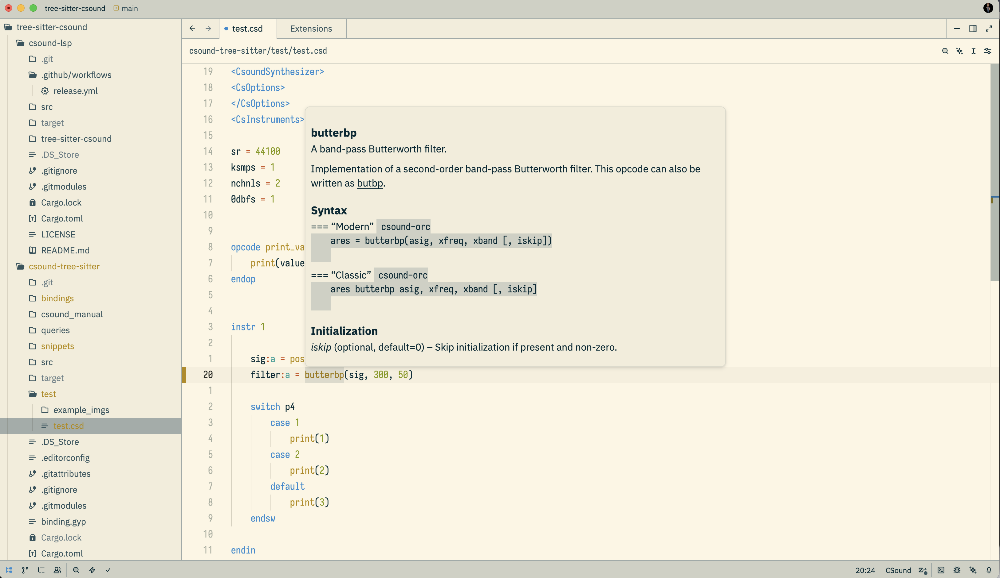

# Csound Language Server (Work in Progress)

This is an experimental Language Server Protocol (LSP) implementation for Csound, written in Rust.  
The goal of this project is to provide a modern development experience for Csound users by integrating language features directly into editors such as  Zed, VS Code, Neovim, and others that support LSP.  

**Installation**  
You can download the latest binary from the Release page or install from source.  
From source: you need the csound-lsp executable available in your system PATH.  
Cloning the repo. The project uses git submodules, so make to clone it with:  

```bash
git clone --recursive https://github.com/PasqualeMainolfi/csound-lsp.git 
```

If you already cloned without `--recursive`, run:

```bash
git submodule update --init --recursive
```

To update submodules later:

```bash
git submodule update --remote --recursive
```

To install the language server, run:

```bash
cargo install --path
```

or, you can build from source:

```bash
cargo build --release
```

and then move from `target/release/csound-lsp` somewhere in your PATH.


**Current Status**
This project is under active development.  
Many features are incomplete or experimental, and breaking changes are expected.  


